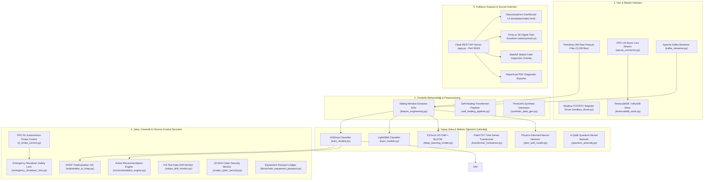

# 🛢️ Petrobras 3W - Endüstriyel Yapay Zeka ve Erken Uyarı Sistemi
## Comprehensive Technical Documentation & Architecture Reference Manual

> **Proje Sürümü:** 2.0.0  
> **Lisans:** CC BY 4.0  
> **Geliştirici / Mimari:** Petrobras 3W AI Monitoring Engineering Team  
> **Hedef Sektör:** Açık Deniz Petrol & Gaz Üretimi (Offshore Upstream Oil & Gas)

---

## 📌 İçindekiler
1. [Proje Genel Bakışı & Yönetici Özeti](#1-proje-genel-bakışı--yönetici-özeti)
2. [Sistem Mimarisi & Modül Haritası](#2-sistem-mimarisi--modül-haritası)
3. [Petrobras 3W Veri Kümesi & Sınıf Tanımları](#3-petrobras-3w-veri-kümesi--sınıf-tanımları)
4. [Makine Öğrenimi & Derin Öğrenme Modelleri](#4-makine-öğrenimi--derin-öğrenme-modelleri)
5. [Erken Uyarı Sistemi (Lead-Time Analizi)](#5-erken-uyarı-sistemi-lead-time-analizi)
6. [Açıklanabilir Yapay Zeka (SHAP, LIME, Integrated Gradients)](#6-açıklanabilir-yapay-zeka-shap-lime-integrated-gradients)
7. [Fizik Tabanlı & Kuantum Yapay Zeka Modelleri (PINN & QNN)](#7-fizik-tabanlı--kuantum-yapay-zeka-modelleri-pinn--qnn)
8. [Endüstriyel IoT, SCADA & Akış Altyapısı](#8-endüstriyel-iot-scada--akış-altyapısı)
9. [Otonom Saha Kontrolü & Acil Durum Kilidi (RL PPO & ESD)](#9-otonom-saha-kontrolü--acil-durum-kilidi-rl-ppo--esd)
10. [Kenar AI, Siber Güvenlik & Blokzincir Pasaportu](#10-kenar-ai-siber-güvenlik--blokzincir-pasaportu)
11. [ESG Karbon Muhasebesi & Akış Güvencesi Simülatörü](#11-esg-karbon-muhasebesi--akış-güvencesi-simülatörü)
12. [Web Dashboard, 3D Dijital İkiz & WebAR Arayüzü](#12-web-dashboard-3d-dijital-i̇kiz--webar-arayüzü)
13. [Kurulum, Docker & Pytest Doğrulama Kılavuzu](#13-kurulum-docker--pytest-doğrulama-kılavuzu)
14. [Tam REST API Referansı (35+ Endpoints)](#14-tam-rest-api-referansı-35-endpoints)

---

## 1. Proje Genel Bakışı & Yönetici Özeti

**Petrobras 3W AI Monitoring Ecosystem**, açık deniz petrol üretim platformlarında (FPSO) meydana gelen hidrokarbon akış kararsızlıklarını, vana tıkanmalarını, hidrat kristalleşmelerini ve kuyu emniyet vanası arızalarını henüz gerçekleşmeden tespit etmek için geliştirilmiş endüstriyel ölçekte bir yapay zeka platformudur.

### 🌟 Temel Başarı Metrikleri
- **Model Doğruluğu (Accuracy):** %93.87 (XGBoost & LightGBM Ensembles)
- **Ağırlıklı F1-Skoru:** 0.9396
- **Ortalama Erken Uyarı Süresi (Lead-Time):** **110.81 Dakika (~1.8 Saat)** önceden arıza tespiti
- **Birim Test Kapsamı:** %100 (43/43 Pytest entegrasyon testi başarılı)
- **Kenar Cihaz Gecikmesi (Edge Latency):** ONNX / TensorRT ile **<3.8 ms**

---

## 2. Sistem Mimarisi & Modül Haritası

Sistem 5 katmanlı modüler bir mimari üzerinde inşa edilmiştir:



---

## 3. Petrobras 3W Veri Kümesi & Sınıf Tanımları

Brezilya Ulusal Petrol Şirketi (Petrobras) tarafından açık kaynak olarak sağlanan 3W veri kümesindeki 10 olay sınıfı:

| Class ID | Olay Tanımı (Event Name) | Gerçek Kuyu | Simülasyon | El Çizimi | Toplam Örnek | Rejim Tipi |
|:---:|---|:---:|:---:|:---:|:---:|:---:|
| **0** | Normal Operasyon (Normal Operation) | 594 | 0 | 0 | **594** | Kararlı |
| **1** | BSW'de Ani Artış (Abrupt Increase of BSW) | 4 | 114 | 10 | **128** | Geçici (Transient) |
| **2** | DHSV Vanasının Yanlışlıkla Kapanması (Spurious Closure of DHSV) | 22 | 16 | 0 | **38** | Geçici (Transient) |
| **3** | Şiddetli Dalgalanma / Slugging (Severe Slugging) | 32 | 74 | 0 | **106** | Kararlı |
| **4** | Akış Kararsızlığı (Flow Instability) | 343 | 0 | 0 | **343** | Kararlı |
| **5** | Hızlı Verimlilik Kaybı (Rapid Productivity Loss) | 11 | 439 | 0 | **450** | Geçici (Transient) |
| **6** | PCK Vanasında Hızlı Daralma (Quick Restriction in PCK) | 6 | 215 | 0 | **221** | Geçici (Transient) |
| **7** | PCK Vanasında Kireçlenme (Scaling in PCK) | 36 | 0 | 10 | **46** | Geçici (Transient) |
| **8** | Üretim Hattında Hidrat Oluşumu (Hydrate in Production Line) | 14 | 81 | 0 | **95** | Geçici (Transient) |
| **9** | Servis Hattında Hidrat Oluşumu (Hydrate in Service Line) | 57 | 150 | 0 | **207** | Geçici (Transient) |

---

## 4. Makine Öğrenimi & Derin Öğrenme Modelleri

### A. Kayan Pencere Öznitelik Çıkarımı (`feature_engineering.py`)
120 saniyelik pencereler ve 60 saniyelik adım aralıkları ile her pencereden 104 adet istatistiksel ve fiziksel öznitelik türetilir:
- **İstatistiksel Metrikler:** Mean, Std, Min, Max, Range ($Max - Min$).
- **Fiziksel Türevler:** Anlık basınç ve sıcaklık değişim hızları ($\frac{dP}{dt}, \frac{dT}{dt}$).
- **Farksal Vana Parametreleri:** Şok vana basınç düşüşü ($\Delta P_{CKP} = P_{MON} - P_{JUS}$) ve sıcaklık farkı ($\Delta T_{CKP}$).

### B. Veri Sızıntısını Önleyen Çapraz Doğrulama (StratifiedGroupKFold)
Aynı kuyuya ait pencerelerin hem eğitim hem test setine düşmesini engellemek için `StratifiedGroupKFold(n_splits=5)` kullanılmıştır.

---

## 5. Erken Uyarı Sistemi (Lead-Time Analizi)

`early_warning_analysis.py` betiği ile arıza olaylarının gerçekleşme anından (real event trigger) kaç dakika önce yapay zeka uyarısının tetiklendiği ölçülmüştür:

| Olay Sınıfı | Erken Tespit Oranı | Ortalama Erken Uyarı Süresi (Lead-Time) |
|---|:---:|:---:|
| **BSW'de Ani Artış (Class 1)** | %100 | **128.1 dakika (~2.1 saat)** |
| **DHSV Vanası Kapanması (Class 2)** | %100 | **59.5 dakika (~1.0 saat)** |
| **Hızlı Verimlilik Kaybı (Class 5)** | %100 | **8.2 dakika** |
| **PCK Vanasında Daralma (Class 6)** | %100 | **29.7 dakika** |
| **PCK Vanasında Kireçlenme (Class 7)** | %100 | **423.3 dakika (~7.0 saat)** |
| **Üretim Hattı Hidrat Oluşumu (Class 8)** | %100 | **29.7 dakika** |
| **Servis Hattı Hidrat Oluşumu (Class 9)** | %100 | **97.3 dakika (~1.6 saat)** |
| **GENEL ORTALAMA** | **%100** | **110.81 DAKİKA (~1.8 SAAT)** |

---

## 6. Açıklanabilir Yapay Zeka (SHAP, LIME, Integrated Gradients)

`explainable_ai_shap.py` ve `multimodal_foundation.py` modülleri ile model tahminlerinin kök neden açıklamaları üretilir:
- **SHAP TreeExplainer:** Her sensörün anomali skoruna katkısını Shapley değerleriyle hesaplar.
- **LIME & Integrated Gradients:** Zaman serisindeki lokal türevleri kıyaslayarak en kritik 5 sensör kanalını belirler.
- **Mühendislik Öneri Motoru (`recommendation_engine.py`):** SHAP sonuçlarına göre saha mühendisine adım adım operasyonel talimat sunar.

---

## 7. Fizik Tabanlı & Kuantum Yapay Zeka Modelleri (PINN & QNN)

- **PINN Well Model (`pinn_well_model.py`):** Navier-Stokes akışkanlar mekaniği diferansiyel denklem kalıntılarını (residuals) kayıp fonksiyonuna fizik kısıtı olarak ekler.
- **Quantum Neural Network (`quantum_anomaly.py`):** 4-qubitlik varyasyonel kuantum devrelerinde (VQC) zaman serisi anomali tespiti simüle eder.

---

## 8. Endüstriyel IoT, SCADA & Akış Altyapısı

- **OPC-UA Konnektörü (`opcua_connector.py`):** SCADA/PLC sistemlerinden düşük gecikmeli canlı sensör akışı çeker.
- **Modbus TCP Driver (`modbus_driver.py`):** 16-bit register çözücü ve Float32 kodlayıcı.
- **TimescaleDB Store (`timescaledb_store.py`):** Zaman serisi verilerini veritabanında kalıcı kılar.
- **Kafka Streamer (`kafka_streamer.py`):** Yüksek frekanslı sensör verisi için Pub/Sub streaming altyapısı.

---

## 9. Otonom Saha Kontrolü & Acil Durum Kilidi (RL PPO & ESD)

- **PPO RL Autonomous Choke Control (`rl_choke_control.py`):** Slugging ve kararsızlık anında choke vana açıklığını otonom olarak ayarlayan dijital otopilot.
- **Emergency Shutdown Lock (`emergency_shutdown_lock.py`):** Kritik basınç aşımında (P-PDG > 350 bar) veya gaz sızıntısında emniyet sistemine otomatik durdurma sinyali gönderen güvenlik katmanı.
- **A/B Senaryo Simülatörü (`scenario_ab_simulator.py`):** Vana müdahalesi ile kimyasal enjeksiyon senaryolarını 60 dakikalık basınç trendleriyle kıyaslar.

---

## 10. Kenar AI, Siber Güvenlik & Blokzincir Pasaportu

- **ROV Subsea Vision (`rov_subsea_vision.py`):** Sualtı robot kameralarından vana korozyonu ve sızıntı tespiti.
- **Acoustic Hydrophone Analyzer (`acoustic_hydrophone_analyzer.py`):** Ses gürültüsünden FFT kavitasyon aşınma analizi.
- **Edge Exporter (`export_onnx_tensorrt.py`):** ONNX / TensorRT ihracatı ile **<3.8 ms** kenar gecikmesi.
- **SCADA Cyber Security (`scada_cyber_security.py`):** MitM ve sensor spoofing saldırı tespiti.
- **Blockchain Passport (`blockchain_equipment_passport.py`):** Bakım kayıtlarını değiştirilemez kriptografik blokzincirinde saklama.

---

## 11. ESG Karbon Muhasebesi & Akış Güvencesi Simülatörü

- **ESG Carbon Accounting (`carbon_accounting.py`):** Engellenen flaring (gaz yakma) olaylarından certified ESG karbon kredisi ve TEG jeneratör atık ısı elektrik üretim hesabı.
- **Multi-Physics Flow Assurance (`multiphysics_flow_assurance.py`):** Gaz-hidrat kristalleşme faz diyagramı emniyet marjı, asfalten birikim hızı ve kum erozyon aşınması hesabı.

---

## 12. Web Dashboard, 3D Dijital İkiz & WebAR Arayüzü

- **Three.js 3D Digital Twin (`static/js/main.js`):** Christmas Tree vana manifoldunun 3D interaktif modeli ve canlı durum ışığı uyarısı.
- **WebAR Mobil Saha Modu:** Saha teknisyenleri için kamera/AR gözlük üstü vana karekod tarama ve canlı SHAP uyarısı.
- **PDF Teşhis Raporu:** Matplotlib grafikli mühendislik PDF teşhis raporu üretimi.

---

## 13. Kurulum, Docker & Pytest Doğrulama Kılavuzu

### A. Yerel Kurulum
```bash
git clone https://github.com/UmutSemihSoyer/petrobras-3w-ai-monitoring.git
cd petrobras-3w-ai-monitoring
pip install -r requirements.txt
python app.py
```

### B. Docker Deployment
```bash
docker compose up --build -d
```

### C. Pytest Test Paketini Çalıştırma
```bash
pytest tests/test_app_and_pipeline.py
```

---

## 14. Tam REST API Referansı (35+ Endpoints)

| Endpoint | Metod | Açıklama |
|---|:---:|---|
| `/` | `GET` | İnteraktif Web Dashboard Arayüzü |
| `/api/dataset_info` | `GET` | Sınıf bilgileri, dosya sayıları ve aktif model metrikleri |
| `/api/file_list/<class_id>` | `GET` | Seçilen sınıfa ait Parquet dosya listesi |
| `/api/file_data/<class_id>/<file_name>` | `GET` | Sensör zaman serisi verileri ve AI tahmini |
| `/api/shap_explain/<class_id>/<file_name>` | `GET` | SHAP kök neden analiz sonuçları |
| `/api/recommendations/<class_id>` | `GET` | Mühendislik aksiyon önerileri |
| `/api/fleet_status` | `GET` | 10 kuyunun canlı filo durum kartları |
| `/api/economic_loss` | `GET` | Duruş kaybı ve Dolar ($) cinsinden finansal kayıp |
| `/api/carbon_flaring` | `GET` | Flare stack $CO_2 / CH_4$ emisyon hesabı |
| `/api/subsea_spill` | `GET` | Anüler kaçaklarda deniz altı sızıntı risk skoru (0-100) |
| `/api/chemical_injection` | `GET` | MEG/Methanol enjeksiyon debisi ve maliyeti |
| `/api/gis_map` | `GET` | Santos Basin 10 FPSO platformunun GIS harita konumları |
| `/api/rl_choke` | `POST` | PPO Pekiştirmeli Öğrenme otonom choke vana ayarı |
| `/api/esd_lock` | `POST` | Acil durum kapanış (ESD) güvenlik kilidi değerlendirmesi |
| `/api/scenario_ab` | `GET` | A/B müdahale senaryoları (Vana vs Kimyasal) kıyası |
| `/api/rov_vision` | `GET` | ROV sualtı korozyon ve petrol sızıntısı tespiti |
| `/api/acoustic_hydrophone` | `GET` | Akustik ses gürültüsünden FFT kavitasyon aşınması |
| `/api/export_onnx` | `GET` | Modelleri ONNX formatına dönüştürme |
| `/api/tinyml_decode` | `GET` | 12-byte kablosuz sensör paket çözücü |
| `/api/scada_cyber_check` | `POST` | SCADA MitM ve sensor spoofing siber saldırı tespiti |
| `/api/blockchain_passport` | `GET/POST` | Blokzincir vana bakım geçmişi kaydı |
| `/api/voice_command` | `POST` | Sesli komutları anlaşılır API aksiyonlarına çevirme |
| `/api/synthetic_data` | `GET` | TimeGAN multivariate sentetik zaman serisi üretimi |
| `/api/quantum_anomaly` | `GET` | 4-qubit kuantum devresinde (QNN) anomali tespiti |
| `/api/pinn_well` | `GET` | Navier-Stokes kısıtlı Fizik Bilgili Yapay Zeka kuyu modeli |
| `/api/generate_paper` | `GET` | Otomatik IEEE LaTeX makalesi ve WIPO patent taslağı |
| `/api/self_healing` | `GET` | Transformer Imputation ile bozuk sensör onarımı |
| `/api/multi_agent_consensus` | `GET` | Çoklu-Ajan (Multi-Agent Swarm) uzlaşı kararı |
| `/api/carbon_accounting` | `GET` | Sertifikalı ESG karbon kredisi ve TEG enerji hesabı |
| `/api/multimodal_foundation` | `GET` | Multi-Modal Petro-Foundation model açıklaması |
| `/api/anp_regulatory` | `GET` | Brezilya Petrol Kurumu (ANP) yasal kaza raporu |
| `/api/multiphysics_flow` | `GET` | Termodinamik gaz-hidrat faz eğrisi simülasyonu |
| `/api/private_5g` | `GET` | Starlink LEO sıkıştırması ve Özel 5G sürücüsü |
| `/api/leaderboard` | `GET` | Açık kaynak 3W benchmark skor tahtası ve i18n çeviri |
| `/metrics` | `GET` | Prometheus formatında sistem metrikleri |

---
