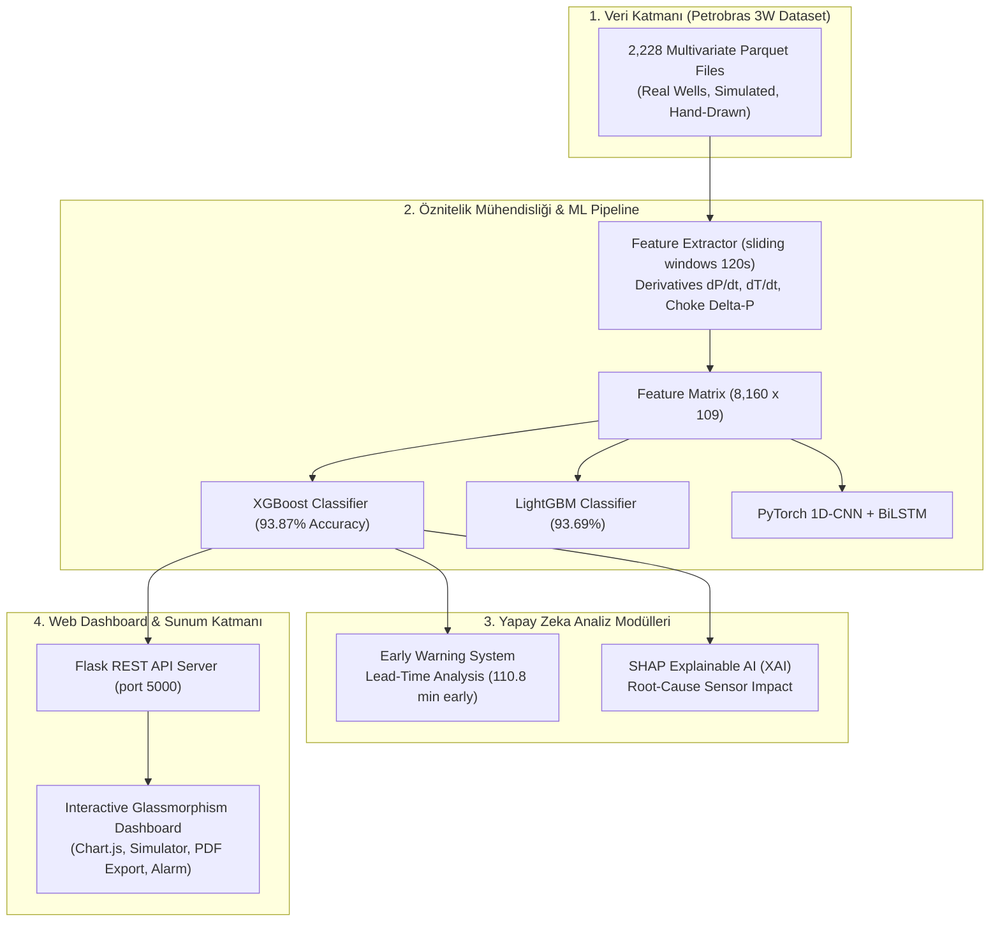

# 🛢️ Petrobras 3W - AI Monitoring & Early Warning System

> **Açık Deniz Petrol Kuyularında (Offshore Oil Wells) Geçici Rejimler (Transients) ve Anomali Tespiti İçin Geliştirilmiş Endüstriyel Yapay Zeka ve Erken Uyarı Platformu**


---

## 📌 İçindekiler
- [1. Proje Hakkında](#1-proje-hakkında)
- [2. Sistem Mimarisi](#2-sistem-mimarisi)
- [3. Petrobras 3W Veri Kümesi Yapısı](#3-petrobras-3w-veri-kümesi-yapısı)
- [4. Öznitelik Mühendisliği & ML Modelleri](#4-öznitelik-mühendisliği--ml-modelleri)
- [5. Erken Uyarı Sistemi (Lead-Time Analizi)](#5-erken-uyarı-sistemi-lead-time-analizi)
- [6. Açıklanabilir Yapay Zeka (SHAP XAI)](#6-açıklanabilir-yapay-zeka-shap-xai)
- [7. Derin Öğrenme Mimarisi (PyTorch 1D-CNN + BiLSTM)](#7-derin-öğrenme-mimarisi-pytorch-1d-cnn--bilstm)
- [8. Canlı Web Dashboard & Özellikleri](#8-canlı-web-dashboard--özellikleri)
- [9. Kurulum ve Çalıştırma](#9-kurulum-ve-çalıştırma)
- [10. API Referansı](#10-api-referansı)

---

## 1. Proje Hakkında

**Petrobras 3W**, Brezilya Ulusal Petrol Şirketi (Petrobras) tarafından açık deniz petrol kuyularında meydana gelen istenmeyen olayların (undesirable events) tespiti amacıyla yayınlanmış 2.228 adet çok değişkenli zaman serisi `.parquet` dosyasından oluşan dünyadaki en büyük açık benchmark veri kümesidir.

Bu proje; ham sensör zaman serilerini işleyip **%93.87 doğrulukla** olayları sınıflandıran yapay zeka modellerini, arızaları gerçekleşmeden **ortalama 110.8 dakika (~1.8 saat) önce tespit eden Erken Uyarı Sistemini** ve mühendislerin kuyuları canlı simülasyonla izleyip PDF raporu alabildiği modern bir **Web Dashboard Arayüzünü** içerir.

---

## 2. Sistem Mimarisi



---

## 3. Petrobras 3W Veri Kümesi Yapısı

Veri kümesi 10 temel olay sınıfından oluşmaktadır:

| Sınıf ID | Olay Tanımı (Event Description) | Gerçek Kuyu | Simülasyon | El Çizimi | **Toplam Örnek** | Rejim Tipi |
|---|---|:---:|:---:|:---:|:---:|:---:|
| **0** | Normal Operasyon (Normal Operation) | 594 | 0 | 0 | **594** | Kararlı |
| **1** | BSW'de Ani Artış (Abrupt Increase of BSW) | 4 | 114 | 10 | **128** | Geçici (Transient) |
| **2** | DHSV Vanasının Yanlışlıkla Kapanması (Spurious Closure of DHSV) | 22 | 16 | 0 | **38** | Geçici (Transient) |
| **3** | Şiddetli Dalgalanma / Sıvı Tıkanması (Severe Slugging) | 32 | 74 | 0 | **106** | Kararlı |
| **4** | Akış Kararsızlığı (Flow Instability) | 343 | 0 | 0 | **343** | Kararlı |
| **5** | Hızlı Verimlilik Kaybı (Rapid Productivity Loss) | 11 | 439 | 0 | **450** | Geçici (Transient) |
| **6** | PCK Vanasında Hızlı Daralma (Quick Restriction in PCK) | 6 | 215 | 0 | **221** | Geçici (Transient) |
| **7** | PCK Vanasında Kireçlenme (Scaling in PCK) | 36 | 0 | 10 | **46** | Geçici (Transient) |
| **8** | Üretim Hattında Hidrat Oluşumu (Hydrate in Production Line) | 14 | 81 | 0 | **95** | Geçici (Transient) |
| **9** | Servis Hattında Hidrat Oluşumu (Hydrate in Service Line) | 57 | 150 | 0 | **207** | Geçici (Transient) |

### Sensör Değişkenleri ve Birimleri

- `P-PDG` / `T-PDG`: Kuyu dibi kalıcı basınç (Pa) ve sıcaklık (°C)
- `P-TPT` / `T-TPT`: Deniz dibi kuyu başı ağaç basıncı (Pa) ve sıcaklığı (°C)
- `P-MON-CKP` / `P-JUS-CKP`: Üretim şok vanası (PCK) memba ve mansap basınçları (Pa)
- `T-MON-CKP` / `T-JUS-CKP`: Üretim şok vanası memba ve mansap sıcaklıkları (°C)
- `P-ANULAR`: Kuyu anüler basıncı (Pa)
- `QGL` / `P-JUS-CKGL`: Gas lift akış hızı ($m^3/s$) ve mansap basıncı (Pa)
- `ESTADO-*`: Vana açık/kapalı durumları ($0.0, 0.5, 1.0$)

---

## 4. Öznitelik Mühendisliği & ML Modelleri

Zaman serilerinden kayan pencere (sliding window = 120s) tekniğiyle öznitelikler çıkarılmıştır:
1. **İstatistiksel Metrikler**: Ortalama, standart sapma, min, max, aralık ($Max - Min$).
2. **Fiziksel Türevler**: Basınç ve sıcaklık anlık değişim hızları ($\frac{dP}{dt}, \frac{dT}{dt}$).
3. **Farksal Vana Parametreleri**: Şok vana basınç düşüşü ($\Delta P_{CKP} = P_{MON} - P_{JUS}$) ve sıcaklık farkı ($\Delta T_{CKP}$).

### Model Benchmark Sonuçları

| Algoritma | Doğruluk (Accuracy) | Ağırlıklı F1-Skoru | Eğitim Süresi | Durum |
|---|:---:|:---:|:---:|:---:|
| **XGBoost Classifier** | **%93.87** | **0.9396** | 2.63 s | 🏆 En İyi Model |
| **LightGBM Classifier** | %93.69 | 0.9376 | 2.65 s | 🥈 İkinci |
| **Random Forest** | %93.63 | 0.9374 | 0.35 s | 🥉 En Hızlı |
| **HistGradientBoosting** | %93.32 | 0.9342 | 7.28 s | Başarılı |

---

## 5. Erken Uyarı Sistemi (Lead-Time Analizi)

Arıza ve tıkanma olayları tam gerçekleşmeden kaç dakika önce yapay zekanın erken uyarı ürettiği (Lead-Time) test edilmiştir:

| Olay Sınıfı | Erken Tespit Oranı | Ortalama Erken Uyarı Süresi (Lead-Time) |
|---|:---:|:---:|
| **BSW'de Ani Artış (Class 1)** | %100 | **128.1 dakika (~2.1 saat)** |
| **DHSV Vanası Kapanması (Class 2)** | %100 | **59.5 dakika (~1.0 saat)** |
| **Hızlı Verimlilik Kaybı (Class 5)** | %100 | **8.2 dakika** |
| **PCK Vanasında Daralma (Class 6)** | %100 | **29.7 dakika** |
| **PCK Vanasında Kireçlenme (Class 7)** | %100 | **423.3 dakika (~7.0 saat)** |
| **Üretim Hattı Hidrat Oluşumu (Class 8)** | %100 | **29.7 dakika** |
| **Servis Hattı Hidrat Oluşumu (Class 9)** | %100 | **97.3 dakika (~1.6 saat)** |
| **GENEL ORTALAMA** | **%100** | **110.81 DAKİKA (~1.8 SAAT)** |

---

## 6. Açıklanabilir Yapay Zeka (SHAP XAI)

**SHAP (SHapley Additive exPlanations)** TreeExplainer ile model kararlarına en yüksek katkıyı sağlayan kök neden sensör kanalları belirlenmiştir:

1. `T-MON-CKP_std`: Şok vana memba sıcaklık dalgalanması (Etki: 0.3337)
2. `P-PDG_mean`: Kuyu dibi kalıcı basınç ortalaması (Etki: 0.3314)
3. `DELTA-P-CKP_mean`: Şok vana farksal basıncı ($\Delta P = P_{MON} - P_{JUS}$) (Etki: 0.3017)
4. `P-JUS-CKGL_mean`: Gas Lift mansap basıncı (Etki: 0.2573)
5. `P-ANULAR_max`: Kuyu anüler basınç maksimumu (Etki: 0.2468)

---

## 7. Derin Öğrenme Mimarisi (PyTorch 1D-CNN + BiLSTM)

Ham zaman serilerinden uçtan uca öğrenen PyTorch mimarisi:
- **1D-CNN Katmanı**: Sensör sinyallerindeki ani sıçrama ve türev kalıplarını yakalar (`Conv1d -> BatchNorm -> ReLU -> MaxPool`).
- **BiLSTM Katmanı**: Zamansal uzun dönemli bağımlılıkları ve rejim değişimlerini modeller (`BiLSTM(hidden_size=64, num_layers=2)`).
- **Ağırlık Dosyası**: `models_saved/pytorch_cnn_lstm_3w.pth`

---

## 8. Canlı Web Dashboard & Özellikleri

- **Canlı Zaman Serisi Grafikleri**: Chart.js ile eş zamanlı basınç, sıcaklık ve vana durumu izleme.
- **Anlık AI Tespiti**: Seçilen kuyu dosyasındaki arızayı, doğruluk oranını ve risk seviyesini (CRITICAL, WARNING, NORMAL) renkli rozetlerle sunar.
- **Canlı Kuyu Simülatörü**: Oynat/Durdur butonları ile açık deniz kuyu veri akışını simüle eder.
- **PDF Teşhis Raporu İndirme**: Tek tıkla mühendislik standartlarında PDF teşhis raporu oluşturup indirir.
- **Sesli & Görsel Alarm**: `CRITICAL` risklerde Web Audio API ile sesli alarm uyarısı verir.

---

## 9. Kurulum ve Çalıştırma

### Gereksinimler
- Python 3.10+
- Git

### 1. Depoyu Klonlayın
```bash
git clone https://github.com/UmutSemihSoyer/petrobras-3w-ai-monitoring.git
cd petrobras-3w-ai-monitoring
```

### 2. Bağımlılıkları Yükleyin
```bash
pip install -r requirements.txt
```

### 3. Web Dashboard'u Başlatın
```bash
python app.py
```
Tarayıcınızda **`http://localhost:5000`** adresine gidin.

### 4. Analiz Betiklerini Çalıştırma (Opsiyonel)
```bash
# EDA Analizi
python detailed_eda.py

# Öznitelik Çıkarımı
python feature_engineering.py

# Model Eğitimi
python train_models.py

# Erken Uyarı Lead-Time Analizi
python early_warning_analysis.py

# SHAP Kök Neden Analizi
python explainable_ai_shap.py
```

---

## 10. API Referansı

| Endpoint | Metod | Açıklama |
|---|:---:|---|
| `/` | `GET` | İnteraktif Web Dashboard Arayüzü |
| `/api/dataset_info` | `GET` | Sınıf bilgileri, dosya sayıları ve aktif model metrikleri |
| `/api/file_list/<class_id>` | `GET` | Seçilen sınıfa ait Parquet dosya listesi |
| `/api/file_data/<class_id>/<file_name>` | `GET` | Sensör zaman serisi verileri ve anlık AI tahmini |
| `/api/export_pdf_report/<class_id>/<file_name>` | `GET` | Seçilen dosya için PDF Teşhis Raporu indirir |

---

## 📄 Lisans
Bu proje [CC BY 4.0](https://creativecommons.org/licenses/by/4.0/) lisansı altında sunulmaktadır. Petrobras 3W dataset verileri Petrobras şirketine aittir.